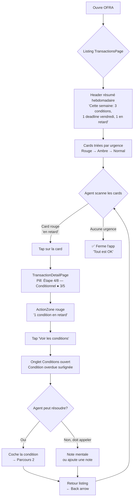
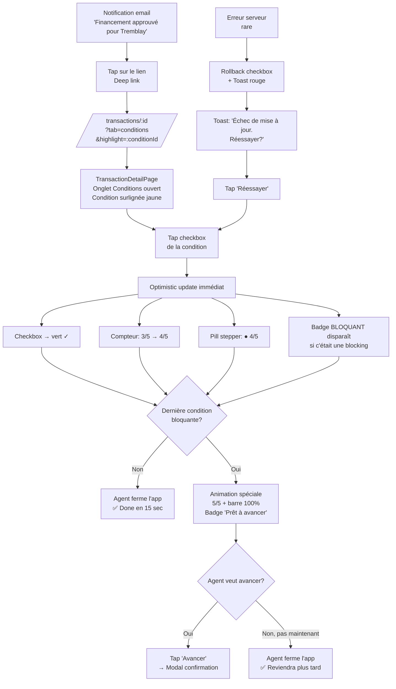
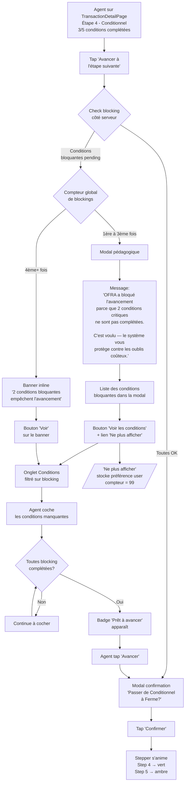
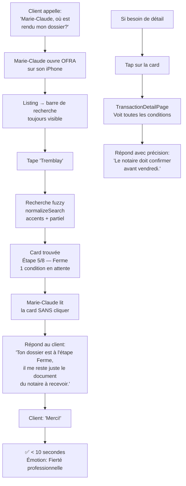
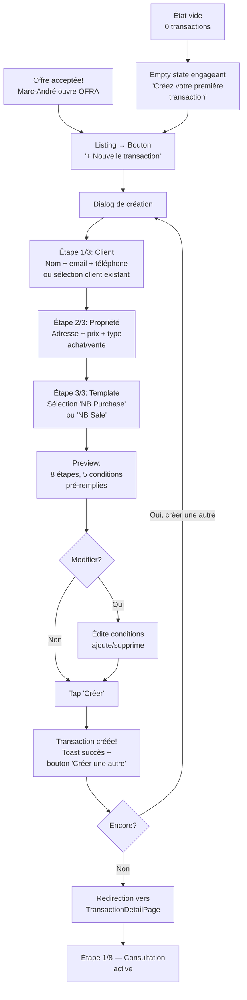
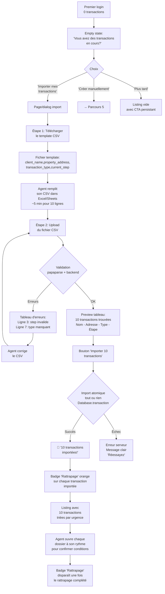
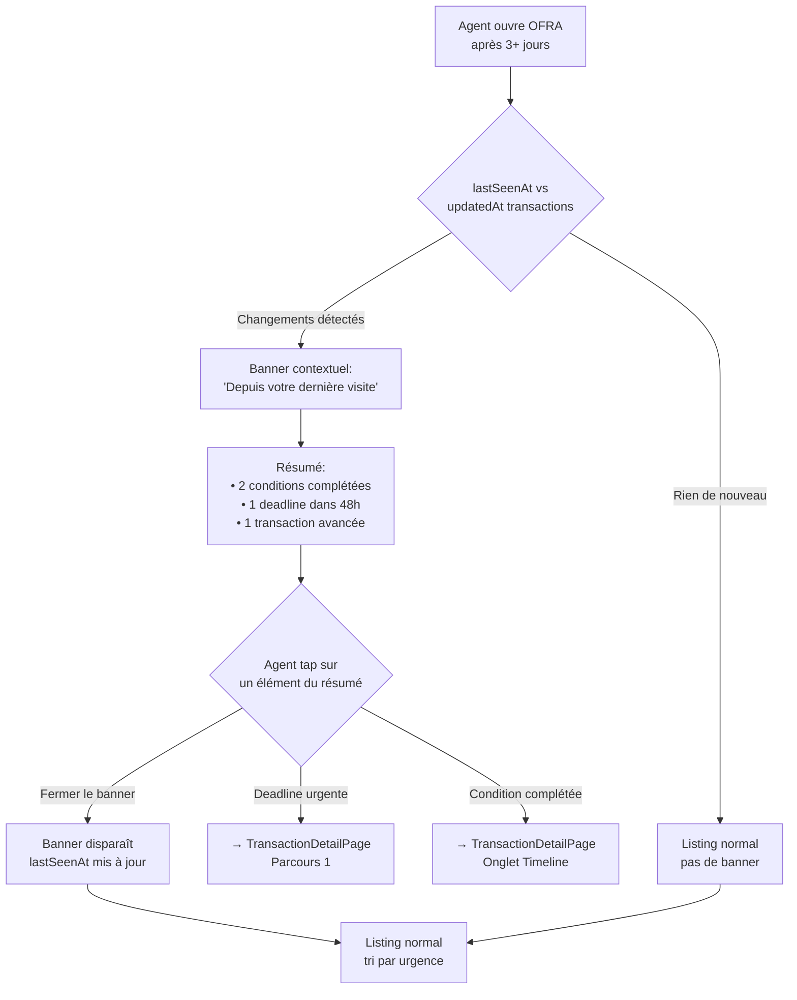

# UX Design Specification OFRA

**Author:** Sam
**Date:** 2026-01-26

---

## Executive Summary

### Vision projet

OFRA est un Transaction Management System pour agents immobiliers canadiens. L'outil sécurise la phase post-signature (de l'offre acceptée au closing) via un pipeline visuel à 8 étapes avec blocking conditions. Le système empêche l'agent d'avancer si des conditions critiques ne sont pas remplies — c'est le différenciateur unique sur le marché.

L'Epic 2 refond l'interface transaction : la page que l'agent utilise quotidiennement pour suivre ses dossiers. L'objectif est de passer d'un god component monolithique (1600 lignes, tout d'un coup) à une interface hiérarchisée, mobile-first, avec onglets et zone d'action urgente.

### Utilisateurs cibles

**Marie-Claude Després** — Courtière expérimentée (12 ans, 28-35 transactions/an), bilingue, MacBook + iPhone. Travaille avec adjointe à temps partiel. Son besoin : "un système qui m'empêche d'oublier". Son traumatisme : une commission de $8,400 perdue par oubli d'une condition. Son critère : pouvoir répondre "ton dossier est à l'étape X, il reste Y conditions" en moins de 10 secondes.

**Marc-André Thériault** — Courtier solo (9 ans, 22-28 transactions/an), bilingue, Windows + Android. Always-on, pas d'adjointe. Passe 1-2h/soir en admin. Son besoin : "un outil qui fait UNE chose bien". Son critère : setup une transaction en < 5 min, réduire l'admin du soir à 15 minutes.

### Défis de design clés

1. **Stepper 8 étapes sur mobile** — Pattern adaptatif nécessaire (collapsed/swipeable sur < 640px, horizontal sur desktop)
2. **Hiérarchie d'information** — Urgences en haut (blocking conditions, deadlines), détails en onglets
3. **Réponse en 10 secondes** — Étape courante + conditions bloquantes immédiatement visibles à l'ouverture
4. **Usage mobile une main** — Touch targets 44px+, actions principales accessibles au pouce, pas de formulaires complexes sur mobile

### Opportunités de design

1. **Le moment "blocking"** — Transformer le blocage en moment produit mémorisable (modal explicite, actions directes, résolution guidée)
2. **Le stepper comme storytelling** — Progression visuelle émotionnelle avec couleurs, icônes et sentiment d'avancement vers le closing
3. **Checklist de survie** — Conditions groupées par step avec % completion, badges "BLOQUANT", countdowns ("dans 3 jours")

### Considérations additionnelles

4. **Page listing comme tableau de bord opérationnel** — Chaque ligne de transaction doit afficher : client, étape courante, badge conditions en retard, prochaine deadline. Vision globale sans cliquer.
5. **Light mode + Dark mode** — Les deux supportés. Défaut : Auto (suit l'OS). Toggle manuel dans les settings. Le dark mode actuel nécessite vérification/fix.
6. **États vides engageants** — Onboarding visuel pour 0 transaction : CTA "Créer votre première transaction", illustration, guidance. Le moment le plus fragile du parcours utilisateur.

---

## Core User Experience

### Expérience définissante

L'expérience core d'OFRA est le **cycle de complétion de conditions** : `notification → ouvrir → cocher → fermer`. Marie-Claude et Marc-André répètent ce cycle plusieurs fois par jour. Chaque interaction doit permettre de résoudre une condition en un minimum de taps.

Le core loop est déclenché par les notifications (email, in-app futur). Le chemin `notification → condition spécifique` doit être le plus court possible via deep link : `/transactions/:id?tab=conditions&highlight=:conditionId`.

L'interaction définissante est le **blocking check** — le moment où le système protège l'agent contre un oubli. Ce moment doit être visuellement mémorisable, explicite, et résolvable en direct.

### Stratégie plateforme

| Plateforme | Usage | Priorité |
|-----------|-------|----------|
| **Mobile (< 640px)** | Check entre visites, cocher conditions, voir l'étape | **P0** — design en premier |
| **Tablette (640-1024px)** | Revue de dossier, updates | P1 |
| **Desktop (> 1024px)** | Gestion complète, création transactions, admin | P1 |

- Web responsive (React + Tailwind), pas d'app native
- Touch-first : tous les éléments interactifs >= 44px
- Pas d'offline requis (connexion nécessaire pour sync)
- Light + Dark mode, défaut Auto (suit l'OS), toggle manuel dans settings

### Interactions sans friction

| Interaction | Objectif | Pattern |
|------------|---------|---------|
| Cocher une condition | 1 tap | Checkbox directe, optimistic update, pas de modal |
| Voir l'étape courante | 0 action | Visible immédiatement (pill compacte sur mobile, stepper sur desktop) |
| Avancer une étape | 1 tap + confirmation | Bouton "Avancer" → modal confirmation si conditions OK |
| Blocking check | Automatique | 1ère fois : modal pédagogique. Ensuite : banner inline persistant + badge rouge |
| Naviguer entre dossiers | Back/swipe | Header fixe avec back arrow, swipe horizontal mobile |
| Voir toutes les deadlines | 1 tap | Onglet Conditions avec tri par date, badges countdown |
| Deep link notification | 1 tap | Notification → onglet conditions → condition surlignée |

### Moments critiques de succès

| Moment | Ce qui se passe | Impact |
|--------|----------------|--------|
| **Premier blocking** | L'agent essaie d'avancer, le système bloque avec message pédagogique | "Aha — ça me protège!" → adoption |
| **Check matinal** | Dashboard → 2 dossiers urgents → résolution en 5 min | "Ça a remplacé mon Excel" → rétention |
| **Appel client** | "Ton dossier est à l'étape 5, reste 1 condition" en 10 sec | "Je suis pro" → recommandation |
| **Closing sans stress** | Toutes les conditions complétées, zéro surprise | "J'ai bien dormi cette semaine" → fidélité |
| **Première transaction** | Création < 5 min, conditions pré-remplies | "C'est simple!" → activation |

### Principes d'expérience

1. **10 secondes ou échec** — Chaque écran doit répondre à la question de l'utilisateur en moins de 10 secondes. Si l'info est cachée, c'est un bug UX.
2. **Le blocage est un feature, pas un bug** — Le moment blocking doit être célébré visuellement, pas minimisé. C'est la promesse produit.
3. **Mobile d'abord, toujours** — Si ça ne marche pas avec un pouce sur un iPhone, ça ne marche pas.
4. **Agir, pas lire** — Chaque écran doit proposer une action claire. Pas de pages "informatives" sans next step.
5. **Le dossier raconte une histoire** — Du premier contact au closing, le stepper visualise la progression. L'agent SENT qu'il avance.

### Charte graphique

#### Palette de couleurs : Bleu marine + Ambre (signature OFRA)

| Rôle | Light mode | Dark mode | Usage |
|------|-----------|-----------|-------|
| Primaire | `#1E3A5F` (bleu marine) | `#60A5FA` | Navigation, headers, boutons principaux |
| Accent | `#F59E0B` (ambre/or) | `#FBBF24` | CTAs, badges importants, stepper actif |
| Succès | `#10B981` (vert émeraude) | `#34D399` | Conditions complétées, étapes terminées |
| Danger | `#EF4444` (rouge) | `#F87171` | Blocking, overdue, erreurs |
| Warning | `#F97316` (orange) | `#FB923C` | Deadlines proches |
| Fond | `#F8FAFC` | `#0F172A` | Background principal |
| Carte | `#FFFFFF` | `#1E293B` | Cards, modals |
| Texte principal | `#0F172A` | `#F1F5F9` | Corps de texte |
| Texte secondaire | `#64748B` | `#94A3B8` | Labels, descriptions |

#### Typographie : Inter

- Titres (h1-h3) : Inter 600-700, 24-32px
- Sous-titres : Inter 500, 16-20px
- Corps : Inter 400, 14-16px
- Labels/badges : Inter 500, 12-13px
- Monospace (montants) : JetBrains Mono 400, 13px

#### Iconographie

- **MVP** : Lucide Icons (gratuit, open source)
- **Post-validation** : Migration vers Hugeicons Pro ($99, 46,000+ icônes, 10 styles, React npm natif)
- Pas d'investissement avant validation du product-market fit

#### Design tokens

- Border radius : cards `rounded-xl` (12px), boutons `rounded-lg` (8px), badges `rounded-full`
- Shadows : cards `shadow-sm`, modals `shadow-xl`
- Spacing : système ×4 (4, 8, 12, 16, 20, 24, 32, 48px)
- Touch target minimum : 44px × 44px
- Transitions : 150ms ease-in-out

#### Ton visuel : Pro-warm

Professionnel mais pas froid. L'app d'un collègue de confiance, pas d'une banque. Coins arrondis, ombres subtiles, couleurs saturées sans être criantes, espacement généreux, animations subtiles (Framer Motion).

---

## Desired Emotional Response

### Primary Emotional Goals

| # | Émotion primaire | Description | Déclencheur | Persona dominante |
|---|-----------------|-------------|-------------|-------------------|
| 1 | **Protection sereine** | "Le système veille pour moi" | Blocking check — le moment où OFRA empêche un oubli coûteux | Marie-Claude (trauma $8,400) |
| 2 | **Maîtrise instantanée** | "Je sais exactement où j'en suis" | Ouverture dossier → étape + conditions en < 10 secondes | Les deux (appel client) |
| 3 | **Progression tangible** | "J'avance vers le closing" | Stepper qui se remplit, conditions qui se cochent, % qui monte | Les deux (quotidien) |
| 4 | **Efficacité libératrice** | "C'est fini, je peux profiter de ma soirée" | Session admin < 15 min, tout à jour, fermeture sereine | Marc-André (fatigue chronique admin) |

**Émotion signature d'OFRA** : Le **soulagement protecteur** — le moment où l'agent réalise que le système l'a empêché de faire une erreur. C'est l'émotion qui génère le bouche-à-oreille : "Tu connais pas OFRA? Ça m'a sauvé une commission."

**Note** : Les deux personas ne sont pas deux types d'émotions — ce sont deux **dosages** du même spectre. Marie-Claude met le volume plus fort sur la protection, Marc-André sur l'efficacité, mais les deux ressentent les quatre émotions. Un agent avec 10 dossiers en même temps vivra un mélange des deux profils selon le moment de la journée.

### Emotional Journey Mapping

| Moment du parcours | Émotion visée | Émotion à éviter | Design implication |
|--------------------|--------------|-------------------|-------------------|
| **Première visite (0 transaction)** | Curiosité + simplicité ("c'est clean") | Intimidation, complexité | État vide engageant, CTA unique, pas de dashboard vide |
| **Création 1ère transaction** | Facilité + "c'est rapide" | Friction, formulaires longs | < 5 min setup, conditions pré-remplies par template |
| **Check matinal** | Efficacité + contrôle | Surcharge, anxiété | Dashboard listing → dossiers urgents en haut, badges clairs |
| **Retour après absence** | Continuité ("le système vit entre mes visites") | Désorientation | "Depuis votre dernière visite : 2 conditions complétées, 1 nouvelle deadline dans 3 jours" |
| **Premier blocking** | Surprise → compréhension → gratitude | Frustration, sentiment d'être bloqué | Modal pédagogique : "C'est voulu — on vous protège" |
| **Cycle cocher condition** | Satisfaction rapide, micro-accomplissement | Lenteur, friction | 1 tap, optimistic update, feedback visuel immédiat |
| **Appel client** | Confiance professionnelle | Panique, recherche | Réponse en 10 sec : "Étape X, reste Y conditions" |
| **Étape longue (14+ jours)** | Progression continue malgré le plateau | Stagnation, ennui | Progression à deux niveaux : macro (steps) + micro (% conditions par step) |
| **Closing** | Fierté + soulagement | Stress de dernière minute | Toutes conditions vertes, zéro surprise, célébration subtile |
| **Fin de session (soir)** | "Tout est à jour, je ferme" | Doute, anxiété résiduelle | Résumé implicite : 0 en retard = sérénité |

### Micro-Emotions

| Paire émotionnelle | Cible OFRA | Comment on y arrive |
|-------------------|------------|---------------------|
| **Confiance** vs Confusion | Confiance | Hiérarchie claire : urgences en haut, détails en onglets. Jamais 1600 lignes d'un coup. |
| **Confiance** vs Scepticisme | Confiance | Le blocking prouve sa valeur dès le 1er usage. Le système tient sa promesse. |
| **Accomplissement** vs Frustration | Accomplissement | Chaque tap produit un résultat visible. Checkbox → vert. Stepper → avance. |
| **Calme** vs Anxiété | Calme | Badges countdown ("dans 3 jours") au lieu de dates brutes. Warning progressif, pas alarmiste. |
| **Fierté** vs Embarras | Fierté | L'agent répond au client en 10 secondes. Il paraît organisé et pro. |
| **Continuité** vs Désorientation | Continuité | Le système communique les changements depuis la dernière visite. |

**Micro-émotion critique** : Le **"clic de soulagement"** — cocher la dernière condition bloquante d'une étape. Ce moment doit être visuellement marqué (animation subtile, changement de couleur du step, badge "Complété").

**Weighted completion** : La satisfaction du clic est proportionnelle à l'enjeu. Cocher "Financement approuvé" sur une transaction de $350,000 pèse plus que cocher une condition standard. Le design doit rendre le poids visible sans être anxiogène — countdown en contexte, feedback visuel différencié pour conditions bloquantes vs standard.

### Design Implications

| Émotion souhaitée | Approche UX |
|-------------------|-------------|
| **Protection sereine** | Blocking modal avec message humain ("On vous protège"), pas technique ("Erreur: conditions non remplies"). Ton : collègue bienveillant, pas système autoritaire. Banner inline fonctionnel avec bouton d'action direct "Voir les X conditions bloquantes". |
| **Maîtrise instantanée** | Info hierarchy stricte — pill compacte stepper toujours visible, zone d'action urgente en premier, onglets pour le détail. Zero scroll pour l'info critique. |
| **Progression tangible** | Progression à deux niveaux : **Macro** (stepper 8 étapes) + **Micro** (% conditions par step). Pill mobile : "Étape 4/8 — Conditionnel ● 3/5". Casse le plateau émotionnel des étapes longues (14+ jours). |
| **Efficacité libératrice** | Session courte = succès. Design qui permet de résoudre et fermer rapidement. Pas de friction inutile, pas de pages informatives sans action. |
| **Micro-accomplissement** | Optimistic update sur checkbox (vert immédiat), animation subtile (scale 1.05 → 1.0), compteur conditions qui décrémente en temps réel. Feedback différencié pour conditions bloquantes (plus de poids visuel). |
| **Calme organisé** | Countdown humain ("dans 3 jours", "demain", "aujourd'hui!") au lieu de dates. Couleur progressive : vert → orange → rouge selon l'urgence. |
| **Fierté professionnelle** | Design pro-warm (bleu marine + ambre), typographie Inter propre, espacement généreux. L'app que l'agent n'a pas honte de montrer à un client. |
| **Continuité** | "Depuis votre dernière visite" au retour. Le système vit entre les sessions de l'agent. |

### Emotional Design Principles

1. **Le blocage rassure, il ne frustre pas** — Chaque blocking communique "on vous protège" pas "accès refusé". Langage humain, action directe pour résoudre.
2. **Chaque tap = un résultat visible** — Aucune action sans feedback immédiat. Optimistic updates, animations subtiles, changements de couleur. L'agent sent que le système réagit.
3. **Le countdown humanise l'urgence** — "Dans 3 jours" est moins anxiogène que "2026-01-29". Le système parle comme un collègue, pas comme un calendrier.
4. **La progression est à deux niveaux** — Macro (steps inter-étapes) + Micro (conditions intra-étape). Le plateau émotionnel de l'étape 4 (14 jours) est cassé par le % de conditions complétées.
5. **Le zéro-surprise au closing** — L'émotion ultime d'OFRA est la sérénité au closing. Toutes les conditions sont vertes, rien n'a été oublié.
6. **Le poids de la condition compte** — Weighted completion : la satisfaction est proportionnelle à l'enjeu financier. Le design rend ce poids visible sans anxiété.
7. **Le système vit entre les visites** — Continuité émotionnelle via communication des changements depuis la dernière session.

### Proxy Metrics (validation émotionnelle)

| Émotion | Proxy metric | Cible |
|---------|-------------|-------|
| Protection sereine | Taux complétion conditions bloquantes avant deadline | > 90% |
| Maîtrise instantanée | Temps pour répondre "où en est mon dossier?" | < 10 sec |
| Progression tangible | Conditions complétées intra-step pendant étapes longues | Pas de plateau > 5 jours sans activité |
| Efficacité libératrice | Durée moyenne de session | < 5 min |
| Micro-accomplissement | Conditions cochées par session | >= 1 |
| Continuité | Fréquence de retour (sessions/semaine) | >= 3 |

---

## UX Pattern Analysis & Inspiration

### Inspiring Products Analysis

#### 1. Linear (gestion de projets) — Maîtrise + Progression

| Aspect | Ce qu'ils font bien |
|--------|---------------------|
| **Problème résolu** | Vue instantanée de l'état de tous les projets. Zéro surcharge cognitive. |
| **Hiérarchie d'info** | Sidebar minimale, contenu principal maximal. L'info urgente est au premier plan. |
| **Progression** | Barre de progression par cycle, status pills colorées, transitions fluides. |
| **Rapidité** | Tout chargé instantanément, optimistic updates partout. |
| **Pour OFRA** | Le pipeline doit donner cette même sensation de clarté instantanée. Le stepper doit être aussi lisible que les status pills de Linear. |

#### 2. Todoist (checklist) — Micro-accomplissement

| Aspect | Ce qu'ils font bien |
|--------|---------------------|
| **Problème résolu** | Le "clic de satisfaction" — cocher une tâche est physiquement satisfaisant. |
| **Feedback immédiat** | Optimistic update, animation de complétion, compteur qui décrémente en temps réel. |
| **Mobile** | Touch targets généreux, usage une main parfait. |
| **Pour OFRA** | Le cycle cocher-condition doit être AUSSI satisfaisant. Mais avec le poids financier en plus (weighted completion). |

#### 3. Stripe Dashboard (données financières) — Confiance professionnelle

| Aspect | Ce qu'ils font bien |
|--------|---------------------|
| **Problème résolu** | Données financières complexes présentées clairement et de façon rassurante. |
| **Hiérarchie** | Chiffres clés en haut (gros, bold), détails en onglets en dessous. |
| **Ton visuel** | Pro mais pas froid. Couleurs sobres, espacement généreux, typographie impeccable. |
| **Pour OFRA** | Le TransactionDetailPage doit inspirer cette confiance. L'agent montre son écran au client — le design doit être à la hauteur des montants ($200-500K). |

#### 4. Apple Reminders (rappels) — Calme organisé

| Aspect | Ce qu'ils font bien |
|--------|---------------------|
| **Problème résolu** | Ne rien oublier. Listes groupées, dates relatives ("Demain", "Cette semaine"). |
| **Dates relatives** | "Aujourd'hui", "Demain", "Lundi" au lieu de "2026-01-28". Humain, pas technique. |
| **Mobile** | Conçu pour iOS d'abord. Chaque interaction optimisée pour le pouce. |
| **Pour OFRA** | Le pattern countdown ("dans 3 jours", "demain", "aujourd'hui!") est directement inspiré de cette approche humaine. |

#### 5. Concurrents directs — Ce qu'ils font MAL

| Concurrent | Problème UX | Leçon pour OFRA |
|-----------|-------------|-----------------|
| **Dotloop** (Zillow) | Interface surchargée, trop de features, courbe d'apprentissage longue | OFRA fait UNE chose bien. Pas de feature creep. |
| **SkySlope** | Compliance-first, UX secondaire. Aucune émotion positive. | OFRA doit être un outil qu'on AIME utiliser. |
| **Brokermint** | Dashboard analytics complexe, pas adapté mobile | OFRA est mobile-first, orienté agent individuel. |
| **Excel** | Pas de blocking, pas de progression visuelle, erreur humaine constante | Chaque feature manquante d'Excel est une opportunité OFRA. |

### Transferable UX Patterns

#### Patterns de navigation

| Pattern | Source | Application OFRA |
|---------|--------|-----------------|
| **Status pills colorées** | Linear | Pill compacte stepper mobile : "Étape 4/8 — Conditionnel ● 3/5" avec couleur par statut |
| **Tab navigation** | Stripe Dashboard | Onglets Conditions/Offres/Documents/Timeline/Notes — switch instantané |
| **Back arrow fixe** | iOS standard | Header fixe avec back arrow, nom client, pill stepper |

#### Patterns d'interaction

| Pattern | Source | Application OFRA |
|---------|--------|-----------------|
| **Optimistic checkbox + toast explicite** | Todoist + Stripe | Cocher condition → vert immédiat. Si erreur serveur : rollback + toast "Réessayer?" Pas de rollback silencieux. |
| **Bottom sheet** | Apple Maps/iOS | Tap sur pill stepper mobile → bottom sheet avec stepper complet + détails étape |
| **Refetch automatique** | React Query standard | Refresh du dossier au retour de focus. Remplace pull-to-refresh (inadapté en webapp). |

#### Patterns visuels

| Pattern | Source | Application OFRA |
|---------|--------|-----------------|
| **Progression colorée** | Linear | Stepper : gris (future) → ambre (actif) → vert (complété). Transition animée. |
| **Dates relatives** | Apple Reminders | "Dans 3 jours", "Demain", "Aujourd'hui!" au lieu de dates ISO |
| **Cards avec hierarchy** | Stripe | Card transaction listing : client bold en haut, step + badge au milieu, deadline en bas |
| **Empty state illustré** | Notion | 0 transactions → illustration + CTA "Créer votre première transaction" |

### Anti-Patterns to Avoid

| Anti-pattern | Pourquoi c'est mauvais | Garde-fou OFRA |
|-------------|----------------------|----------------|
| **God page** | Surcharge cognitive | Onglets — jamais tout d'un coup |
| **Dates absolues partout** | Aucune urgence perçue | Dates relatives UI, date complète au hover |
| **Modal sur modal** | Fatigue modale, perte de contexte | Max 1 modal. Préférer inline/bottom sheet |
| **Formulaires longs mobile** | Abandon garanti | Création transaction : étapes courtes, sélection > saisie |
| **Badge rouge permanent** | Si tout est rouge, rien n'est urgent | Rouge = UNIQUEMENT en retard (past due) |
| **Stepper horizontal mobile** | Illisible, scroll confus | Pill compacte + bottom sheet |
| **Confirmation pour tout** | Friction inutile | Uniquement pour : avancer étape, supprimer, irréversible |
| **Swipe actions complexes** | Non-découvrable, inconsistant Android/iOS | Tap checkbox direct — MVP sans swipe |
| **Rollback silencieux** | Le système a l'air de mentir | Toast explicite si erreur serveur |

### Design Inspiration Strategy

**Adopter directement :**
- Optimistic updates + toast explicite sur checkbox (Todoist + Stripe)
- Dates relatives humanisées (Apple Reminders)
- Status pills colorées pour le stepper (Linear)
- Tab navigation pour le détail transaction (Stripe)
- Empty states engageants (Notion)
- Refetch automatique au focus (React Query)

**Adapter :**
- Bottom sheet pour stepper mobile (Apple Maps → adapté au contexte 8 étapes OFRA)
- Cards hiérarchisées listing (Stripe → adapté avec step + conditions + deadline)
- Progression par barre (Linear → adapté en deux niveaux macro/micro)

**Éviter :**
- God page à la Dotloop (→ onglets)
- Compliance-first à la SkySlope (→ émotions positives d'abord)
- Dashboard analytics complexe à la Brokermint (→ focus opérationnel)
- Badge inflation (→ rouge réservé au past due uniquement)
- Swipe actions MVP (→ tap direct, swipe post-MVP si validé)
- Pull-to-refresh webapp (→ refetch auto React Query)

### Hiérarchie des couleurs de condition (décision Party Mode)

| Couleur | Signification | Quand |
|---------|--------------|-------|
| **Vert** (`#10B981`) | Complétée | Condition cochée |
| **Ambre** (`#F59E0B`) | Bloquante, pas encore en retard | Condition blocking, deadline future |
| **Rouge** (`#EF4444`) | En retard | Deadline dépassée |
| **Gris** (`#94A3B8`) | Future / non-bloquante | Condition standard, pas urgente |

Distinction clé : **ambre = "occupe-toi de ça bientôt"** vs **rouge = "c'est trop tard, agis maintenant"**. L'ambre est sémantique, pas décoratif.

---

## Design System Foundation

### Design System Choice

**shadcn/ui** — Composants React accessibles basés sur Radix UI, stylés avec Tailwind CSS, copiés localement dans le projet.

### Rationale for Selection

1. **Cohérence Tailwind** — OFRA utilise déjà Tailwind. shadcn/ui est Tailwind-natif, zéro conflit.
2. **Ownership du code** — Les composants sont copiés dans le projet (`components/ui/`), pas une dépendance npm. On possède le code, on le modifie librement.
3. **Accessibilité intégrée** — Radix UI primitives gèrent keyboard navigation, ARIA attributes, focus management.
4. **Personnalisation totale** — La palette bleu marine + ambre s'applique directement via les CSS variables de shadcn/ui.
5. **Composants adaptés** — Tabs, Dialog, Sheet, Checkbox, Toast, Badge, Progress couvrent 90% des besoins UI d'OFRA.
6. **Testabilité** — Radix UI expose des `data-state` attributes (`data-state="checked"`, `data-state="open"`) facilitant les assertions Testing Library.

### Implementation Approach

1. Initialiser shadcn/ui dans le projet frontend (`npx shadcn-ui@latest init`)
2. Configurer les CSS variables avec la palette OFRA en format HSL
3. Installer les composants un par un selon les besoins de chaque story
4. Customiser chaque composant pour respecter les design tokens OFRA (border radius, shadows, spacing, touch targets 44px)

### Composants shadcn/ui planifiés

| Composant | Usage OFRA |
|-----------|-----------|
| `Tabs` | Onglets Conditions/Offres/Documents/Timeline/Notes |
| `Dialog` | Modal blocking, confirmation avancer étape |
| `Sheet` | Bottom sheet stepper mobile (Vaul sous le capot — drag-to-dismiss, snap points) |
| `Checkbox` | Cocher conditions |
| `Badge` | Status pills, countdown, blocking |
| `Progress` | Barre progression step/conditions |
| `Toast` | Feedback optimistic update via Sonner — `toast.error(t('key'), { action })` |
| `Card` | Transaction cards sur listing |
| `Button` | Actions principales |
| `Tooltip` | Date complète au hover des dates relatives |

### Composants custom OFRA (non-shadcn)

| Composant | Raison |
|-----------|--------|
| `StepProgressBar` | Stepper 8 étapes avec progression macro/micro — trop spécifique |
| `StepperPill` | Pill compacte mobile avec bottom sheet — pattern unique OFRA |
| `ActionZone` | Zone d'action urgente (blocking banner + boutons) |
| `ConditionCard` | Card condition avec checkbox, countdown, badge couleur hiérarchisée |
| `CountdownBadge` | Badge dates relatives ("dans 3 jours", "demain", "aujourd'hui!") |
| `EmptyState` | État vide engageant avec illustration + CTA |

### Structure des composants

```
frontend/src/components/
├── ui/                    ← shadcn/ui primitives (on personnalise peu)
│   ├── button.tsx
│   ├── tabs.tsx
│   ├── dialog.tsx
│   ├── sheet.tsx
│   ├── checkbox.tsx
│   ├── badge.tsx
│   ├── progress.tsx
│   ├── toast.tsx
│   ├── tooltip.tsx
│   └── card.tsx
├── transaction/           ← composants métier OFRA
│   ├── TransactionHeader.tsx
│   ├── StepProgressBar.tsx
│   ├── StepperPill.tsx
│   ├── ActionZone.tsx
│   ├── ConditionCard.tsx
│   ├── CountdownBadge.tsx
│   └── tabs/
│       ├── ConditionsTab.tsx
│       ├── OffersTab.tsx
│       ├── DocumentsTab.tsx
│       ├── TimelineTab.tsx
│       └── NotesTab.tsx
└── common/                ← composants partagés
    └── EmptyState.tsx
```

### Customization Strategy

**CSS Variables OFRA (format HSL pour shadcn/ui) :**
- `--primary` : `214 53% 24%` → `#1E3A5F` / dark: `213 94% 68%` → `#60A5FA`
- `--accent` : `38 92% 50%` → `#F59E0B` / dark: `38 93% 56%` → `#FBBF24`
- `--success` : `160 84% 39%` → `#10B981` / dark: `160 67% 52%` → `#34D399`
- `--destructive` : `0 84% 60%` → `#EF4444` / dark: `0 91% 71%` → `#F87171`
- `--warning` : `25 95% 53%` → `#F97316` / dark: `24 94% 61%` → `#FB923C`
- `--background` : `210 40% 98%` → `#F8FAFC` / dark: `222 47% 11%` → `#0F172A`
- `--card` : `0 0% 100%` → `#FFFFFF` / dark: `217 33% 17%` → `#1E293B`

**Touch targets mobile :**
- Variant mobile sur tous les composants interactifs : `h-11 min-w-[44px]` (44px)
- Desktop : `h-9` (36px)
- Pattern Tailwind : `h-11 sm:h-9`

### Décisions techniques (Party Mode)

1. **Framer Motion coupé du MVP** — `tailwindcss-animate` + transitions CSS natifs suffisent pour fade, slide, scale. Framer Motion (+30KB) réévalué en Epic 3 si animations séquencées nécessaires.
2. **Toast via Sonner** (inclus shadcn/ui) — Pattern rollback : `toast.error(t('conditions.updateError'), { action: { label: t('common.retry'), onClick: retry } })`
3. **Tests via data-state** — Assertions stables : `expect(checkbox).toHaveAttribute('data-state', 'checked')` au lieu de classes CSS fragiles.

---

## Defining Core Experience

### Defining Experience

**"Cocher pour avancer, bloquer pour protéger"**

L'agent immobilier coche les conditions de sa transaction une par une. Chaque coche fait avancer visuellement la progression. Quand toutes les conditions bloquantes d'une étape sont cochées, l'agent peut avancer à l'étape suivante. S'il essaie d'avancer sans avoir tout coché, le système bloque et explique pourquoi.

Ce que l'agent dit à un collègue : "J'utilise OFRA — tu coches tes conditions, ça t'empêche d'oublier quoi que ce soit, et le jour du closing t'as zéro surprise."

### User Mental Model

**Comment les agents résolvent ce problème aujourd'hui :**

| Méthode actuelle | Ce qui marche | Ce qui échoue |
|-----------------|---------------|---------------|
| **Excel/Google Sheets** | Flexible, familier | Pas de blocking, pas de rappels, erreur humaine |
| **Checklist papier** | Tangible, satisfaction du "check" | Se perd, pas synchro, pas de deadlines |
| **Mémoire + adjointe** | Rapide | Dépendant d'une personne, risque d'oubli |
| **Dotloop/SkySlope** | Complet | Trop complexe, pas de blocking, UX froide |

**Langage de l'agent (pas celui du développeur) :**
- "Mon dossier Tremblay" (pas "transaction #47")
- "Il me reste le financement et l'inspection" (pas "2 conditions pending sur step 4")
- "Je suis à l'étape des conditions" (pas "conditional-period step active")
- "Qu'est-ce qui arrive CETTE SEMAINE?" (pensée temporelle, pas par dossier)

### Success Criteria

| Critère | Mesure | Cible |
|---------|--------|-------|
| **"Ça marche"** | Cocher → feedback immédiat, progression bouge | < 100ms perçu (optimistic update) |
| **"Je me sens pro"** | Répondre "ton dossier est à l'étape X, reste Y" | < 10 secondes |
| **"Ça me protège"** | Tentative d'avancer bloquée → message clair + action | 100% des blocking conditions détectées |
| **"C'est rapide"** | Session complète (check + mise à jour) | < 5 minutes |
| **"Je comprends"** | Premier blocking → compréhension immédiate | Message pédagogique, pas technique |
| **"J'avance"** | Progression visible après chaque action | Pill/stepper mis à jour en temps réel |

### Novel UX Patterns

**Pattern hybride : Established + Innovation OFRA**

| Élément | Pattern | Type |
|---------|---------|------|
| Checkbox condition | Todoist-style optimistic checkbox | **Établi** |
| Stepper 8 étapes | Progress bar multi-étapes (Linear) | **Établi** |
| Pill compacte mobile | Status pill (iOS, Linear) | **Établi** |
| Bottom sheet stepper | Apple Maps sheet | **Établi** |
| **Blocking check** | **OFRA original** | **Novel** — aucun concurrent ne bloque activement |
| **Progression à deux niveaux** | **OFRA original** | **Novel** — macro (steps) + micro (% conditions) |
| **Weighted completion** | **OFRA original** | **Novel** — feedback proportionnel à l'enjeu |

**Éducation du pattern blocking :**
- Compteur **global** (pas par transaction) — après 3 blocages total → banner inline partout
- Stocké en préférence utilisateur
- Évite la fatigue modale (30 modals si 10 transactions × 3)

### Experience Mechanics

#### 1. Initiation — L'agent ouvre un dossier

| Déclencheur | Ce qui se passe | Ce que l'agent voit |
|-------------|----------------|---------------------|
| Notification email | Deep link → `/transactions/:id?tab=conditions&highlight=:conditionId` | Onglet Conditions ouvert, condition surlignée |
| Tap sur listing | Navigation → TransactionDetailPage | Header + pill stepper + zone d'action |
| Check matinal | Ouvre le listing, scan les badges | Cards triées par urgence + header résumé hebdomadaire |

**Premier écran mobile (above the fold) :**
1. **Header** — Back arrow + nom client + adresse (1 ligne)
2. **Pill stepper** — "Étape 4/8 — Conditionnel ● 3/5"
3. **Zone d'action** — Si blocking : banner ambre. Si overdue : banner rouge.
4. **Onglets** — Conditions (défaut) | Offres | Documents | Timeline | Notes

#### 2. Interaction — L'agent coche une condition

| Étape | Action agent | Réponse système | Durée |
|-------|-------------|-----------------|-------|
| 1 | Tap checkbox | Checkbox → vert immédiat (optimistic via cache React Query) | 0ms perçu |
| 2 | — | Compteur conditions : "3/5 → 4/5" | 100ms animation |
| 3 | — | Pill stepper : "● 4/5" | 100ms animation |
| 4 | — | Si bloquante : badge "BLOQUANT" disparaît | 150ms fade |
| 5 | — | Sync serveur en arrière-plan | ~200ms réseau |
| 6 | — | Si erreur serveur : rollback cache + toast "Réessayer?" | rare |

**Pattern React Query :** `onMutate` (optimistic cache) → `onError` (rollback + toast) → `onSettled` (invalidate query). State partagé pill + onglet via invalidation unique.

**Dernière condition bloquante complétée :** Animation spéciale → compteur "5/5" + barre 100% + badge "Prêt à avancer" → bouton "Avancer" en surbrillance.

#### 3. Feedback — L'agent sait qu'il progresse

| Signal | Type | Quand |
|--------|------|-------|
| Checkbox verte | Visuel immédiat | Chaque complétion |
| Compteur mis à jour | Numérique | Chaque complétion |
| Pill stepper mis à jour | Visuel macro | Chaque complétion |
| Badge "BLOQUANT" disparaît | Visuel relief | Condition bloquante complétée |
| Badge "Prêt à avancer" | Visuel célébration | Toutes bloquantes complétées |
| Toast erreur + retry | Visuel erreur | Échec serveur (rare) |

#### 4. Completion — L'agent avance à l'étape suivante

| Étape | Action | Réponse |
|-------|--------|---------|
| 1 | Tap "Avancer" | Modal confirmation : "Passer de Conditionnel à Ferme?" |
| 2 | Tap "Confirmer" | Stepper s'anime : step 4 → vert, step 5 → ambre |
| 3 | — | Pill : "Étape 5/8 — Ferme ● 0/3" |
| 4 | — | Nouvelles conditions du step 5 apparaissent |
| 5 | — | Activité loggée dans Timeline |

**Blocking si conditions pending :**

| Occurrence | Réponse |
|-----------|---------|
| 1ère-3ème (compteur global) | Modal pédagogique : "OFRA a bloqué l'avancement..." + liste conditions + "Voir les conditions" / "Ne plus afficher" |
| 4ème+ | Banner inline : "2 conditions bloquantes empêchent l'avancement" + bouton "Voir" |

### Le listing comme triage matinal (Party Mode)

Le listing (TransactionsPage) fait partie de l'expérience définissante. C'est le premier écran du check matinal.

**Tri par urgence (défaut) — score calculé côté frontend :**

| Priorité | Critère | Poids |
|----------|---------|-------|
| Maximale | Conditions overdue (past due) | 100 |
| Haute | Conditions bloquantes dans < 3 jours | 50 |
| Moyenne | Conditions bloquantes dans < 7 jours | 20 |
| Normale | Aucune urgence | 0 |

Option secondaire : tri par date. Préférence retenue.

**Header résumé hebdomadaire :**
"Cette semaine : 3 conditions à compléter, 1 deadline vendredi, 1 en retard"

### Onboarding — Import et création rapide

**Deux chemins coexistent :**

| Profil agent | Méthode | Flow |
|-------------|---------|------|
| Agent avec Excel/Sheets | **Import CSV** | Télécharge template → remplit → upload → preview → import |
| Agent sans fichier | **Quick create** | Dialog persistant : client + adresse + étape → "Créer" → "Ajouter un autre" |
| Nouvel agent (0 transaction) | **Création standard** | Flow normal avec état vide engageant |

#### Import CSV — Spécifications

**Format (4 colonnes obligatoires) :**
```csv
client_name,property_address,transaction_type,current_step
"Jean Tremblay","123 rue Principale, Moncton NB",purchase,5
"Marie Bouchard","456 av. Royal, Fredericton NB",sale,3
```

**Règles :**
- Template CSV téléchargeable depuis l'app (headers pré-remplis)
- `current_step` accepte numéro (1-8) ou slug (firm-pending)
- Limite : 50 transactions par import
- Atomique : tout passe ou rien ne passe. L'agent corrige et recommence.
- Parse via `papaparse` (14KB, UTF-8, accents français)
- Backend : `POST /api/transactions/import` → `createTransactionFromTemplate()` + `goToStep()` par ligne
- Étapes passées marquées "skipped" (pas "completed")

**Après import — Badge "Rattrapage" :**
- Chaque transaction importée a un badge orange "Rattrapage" sur le listing
- L'agent ouvre chaque dossier à son rythme et confirme les conditions bloquantes des étapes passées
- Le badge disparaît quand le rattrapage est complété
- Non-bloquant : l'agent fait le rattrapage progressivement

**Flow d'onboarding guidé :**

| Étape | Action | Durée |
|-------|--------|-------|
| 1 | "Vous avez des transactions en cours? Importez-les!" | — |
| 2 | Télécharger le template CSV | 2 sec |
| 3 | Remplir le CSV (10 lignes) | 5 min |
| 4 | Upload → preview tableau → "Importer" | 30 sec |
| 5 | "10 transactions importées! Complétez le rattrapage quand vous voulez." | — |

**Temps total : ~6 minutes pour un portfolio complet.**

**Scope :** Dernière story de l'Epic 2. Planifiée maintenant, décalable en Epic 3 si temps insuffisant.

---

## Visual Design Foundation

### Color System

**Palette OFRA — Bleu marine + Ambre**

| Rôle | Light | Dark | CSS Variable (HSL) |
|------|-------|------|--------------------|
| Primary | `#1E3A5F` | `#60A5FA` | `--primary: 214 53% 24%` / `213 94% 68%` |
| Accent | `#F59E0B` | `#FBBF24` | `--accent: 38 92% 50%` / `38 93% 56%` |
| Success | `#10B981` | `#34D399` | `--success: 160 84% 39%` / `160 67% 52%` |
| Destructive | `#EF4444` | `#F87171` | `--destructive: 0 84% 60%` / `0 91% 71%` |
| Warning | `#F97316` | `#FB923C` | `--warning: 25 95% 53%` / `24 94% 61%` |
| Background | `#F8FAFC` | `#0F172A` | `--background: 210 40% 98%` / `222 47% 11%` |
| Card | `#FFFFFF` | `#1E293B` | `--card: 0 0% 100%` / `217 33% 17%` |
| Text | `#0F172A` | `#F1F5F9` | `--foreground: 222 47% 11%` / `210 40% 98%` |
| Muted | `#64748B` | `#94A3B8` | `--muted-foreground: 215 16% 47%` / `215 20% 65%` |

**Couleurs sémantiques des conditions :**

| Couleur | Hex Light | Signification |
|---------|-----------|---------------|
| Vert | `#10B981` | Condition complétée |
| Ambre | `#F59E0B` | Condition bloquante, pas en retard |
| Rouge | `#EF4444` | Condition en retard (overdue) |
| Gris | `#94A3B8` | Condition future / non-bloquante |

**Couleurs du stepper :**

| État | Light | Dark |
|------|-------|------|
| Complété | `#10B981` (vert) | `#34D399` |
| Actif | `#F59E0B` (ambre) | `#FBBF24` |
| Futur | `#CBD5E1` (gris clair) | `#475569` |
| Skipped | `#94A3B8` (gris) | `#64748B` |

### Typography System

**Police principale : Inter** (Google Fonts, variable font, accents FR)

| Niveau | Poids | Taille | Line height | Usage |
|--------|-------|--------|-------------|-------|
| H1 | 700 | 32px | 1.2 | Titre de page |
| H2 | 600 | 24px | 1.3 | Section titre |
| H3 | 600 | 20px | 1.3 | Sous-section |
| Subtitle | 500 | 16px | 1.4 | Sous-titres, labels importants |
| Body | 400 | 14px | 1.5 | Corps de texte |
| Body large | 400 | 16px | 1.5 | Corps de texte desktop |
| Small | 400 | 13px | 1.4 | Texte secondaire |
| Caption | 500 | 12px | 1.3 | Labels, badges, timestamps |

**Police monospace : JetBrains Mono** — Montants financiers ($350,000), données numériques (13px, 400)

**Responsive sizing :**
- Body : 14px mobile → 16px desktop (`text-sm sm:text-base`)
- H1 : 24px mobile → 32px desktop (`text-2xl sm:text-4xl`)

### Spacing & Layout Foundation

**Système d'espacement ×4 :**

| Token | Valeur | Tailwind | Usage |
|-------|--------|----------|-------|
| `space-1` | 4px | `p-1` | Espacement intra-élément minimal |
| `space-2` | 8px | `p-2` | Padding badges, gap inline |
| `space-3` | 12px | `p-3` | Padding boutons, gap liste |
| `space-4` | 16px | `p-4` | Padding cards, gap sections |
| `space-5` | 20px | `p-5` | Padding containers mobile |
| `space-6` | 24px | `p-6` | Padding containers desktop |
| `space-8` | 32px | `p-8` | Gap entre sections majeures |
| `space-12` | 48px | `p-12` | Espacement entre blocs de page |

**Layout grid :**

| Breakpoint | Colonnes | Gouttière | Container max | Padding |
|-----------|----------|-----------|---------------|---------|
| Mobile (< 640px) | 1 | 16px | 100% | 16px |
| Tablette (640-1024px) | 2 | 24px | 768px | 24px |
| Desktop (> 1024px) | 12 | 24px | 1280px | 32px |

**Densité : Équilibrée**
- Espacement généreux ENTRE les blocs, compact À L'INTÉRIEUR
- Cards : `p-4` intérieur, `gap-4` entre cards
- Listing : cards mode (pas table row), hauteur variable, minimum 80-96px par card
- Card listing contenu : Ligne 1 nom client (bold) + badge step, Ligne 2 adresse (muted), Ligne 3 badges conditions + deadline

**Éléments de surface :**

| Élément | Border radius | Shadow | Fond |
|---------|--------------|--------|------|
| Cards | `rounded-xl` (12px) | `shadow-sm` | `bg-card` |
| Boutons | `rounded-lg` (8px) | aucun | `bg-primary` |
| Badges | `rounded-full` | aucun | variable sémantique |
| Modals | `rounded-xl` (12px) | `shadow-xl` | `bg-card` |
| Bottom sheet | `rounded-t-xl` (12px top) | `shadow-xl` | `bg-card` |
| Inputs | `rounded-lg` (8px) | aucun, `ring` on focus | `bg-background` |

**Transitions :** 150ms `ease-in-out`. `tailwindcss-animate` pour entrées/sorties. `prefers-reduced-motion` → désactivation globale via un media query CSS.

### Accessibility Considerations

**Contraste WCAG AA (4.5:1 texte, 3:1 graphique/large text) :**

| Combo Light mode | Ratio | Statut |
|-----------------|-------|--------|
| Text `#0F172A` sur Background `#F8FAFC` | 15.4:1 | AAA |
| Muted `#64748B` sur Background `#F8FAFC` | 4.6:1 | AA |
| Primary `#1E3A5F` sur White | 9.7:1 | AAA |
| White sur Destructive `#EF4444` | 4.6:1 | AA |
| White sur Success `#10B981` | 3.2:1 | AA graphique (icône checkmark, pas texte seul) |

| Combo Dark mode | Ratio | Statut |
|----------------|-------|--------|
| Text `#F1F5F9` sur Background `#0F172A` | 15.4:1 | AAA |
| Muted `#94A3B8` sur Background `#0F172A` | 6.1:1 | AA |
| Primary `#60A5FA` sur Card `#1E293B` | 5.2:1 | AA |

**Mesures d'accessibilité :**
- Touch targets : 44×44px minimum sur tous les éléments interactifs
- Focus visible : `ring-2 ring-primary ring-offset-2` sur tous les éléments focusables
- Keyboard navigation : gérée par Radix UI (shadcn/ui)
- Screen reader : labels ARIA, `aria-live` pour updates optimistic
- Mouvement réduit : `prefers-reduced-motion` désactive les animations globalement
- Vert succès : toujours combiné avec icône checkmark (pas texte seul sur fond vert)
- Dark mode : snapshot tests recommandés pour vérifier les contrastes

---

## Design Direction Decision

### Design Directions Explored

**TransactionDetailPage — 4 variantes testées :**

| Direction | Description | Verdict |
|-----------|------------|---------|
| A — Pill + Action Zone + Tabs | Pill compacte stepper, zone d'action urgente, onglets | **Base choisie** |
| B — Stepper horizontal ronds + Tabs | Timeline visuelle avec cercles numérotés par étape | **Stepper ronds adopté** |
| C — Pill + scroll vertical (sans tabs) | Tout en un scroll, pas d'onglets | Rejeté — retour au god component |
| D — Pill + Accordions | Sections collapsibles avec compteurs résumé | Compteurs dans tabs empruntés |

**TransactionsPage — 2 variantes testées :**

| Direction | Description | Verdict |
|-----------|------------|---------|
| A — Cards par urgence + résumé hebdo | Tri overdue → blocking → normal | **Choisie** |
| B — Groupé par étape (Kanban) | Transactions groupées par step | Rejeté — urgence prime sur étape |

**Mockup HTML :** `planning-artifacts/ux-design-directions.html`

### Chosen Direction

**TransactionDetailPage : Hybride A + B**

| Écran | Layout |
|-------|--------|
| **Mobile (< 640px)** | Pill compacte "Étape 4/8 — Conditionnel ● 3/5" → tap → bottom sheet avec stepper ronds complet |
| **Tablette (640-1024px)** | Stepper horizontal ronds visible + action zone + tabs |
| **Desktop (> 1024px)** | Stepper horizontal ronds visible (8 cercles, pas de scroll) + action zone + tabs |

**Éléments combinés :**
- De Direction A : Pill compacte mobile, Action Zone urgente, Tabs avec compteurs
- De Direction B : Stepper ronds avec cercles numérotés (✓ complété, N actif, N futur)
- De Direction D : Compteurs résumé dans les labels tabs → "Conditions (3/5)" "Offres (1)" "Documents (3)"

**TransactionsPage : Direction A**
- Cards triées par urgence (score calculé : overdue → blocking proche → normal)
- Bordure gauche colorée : rouge (overdue), ambre (blocking), aucune (normal)
- Header résumé : "Cette semaine : 3 conditions, 1 deadline vendredi, 1 en retard"
- Badge par card : statut conditions + prochaine deadline en date relative

### Design Rationale

1. **Pill + bottom sheet sur mobile** — Compact, élégant, zéro scroll horizontal. Le stepper ronds ne s'affiche en horizontal que sur desktop/tablette où il y a assez de place.
2. **Stepper ronds (Direction B)** — Progression visuelle "storytelling" claire. Chaque cercle raconte une étape du parcours. L'agent VOIT l'avancement. Sam a validé ce pattern comme visuellement satisfaisant.
3. **Tabs avec compteurs** — Combinaison tabs (navigation standard, deep link) + compteurs accordion (résumé visible). "Conditions (3/5)" informe sans cliquer.
4. **Cards par urgence** — Le triage matinal cherche "qu'est-ce qui brûle?", pas "combien à l'étape 4?". Le tri par urgence sert le core loop mieux que le Kanban.
5. **Bordure gauche colorée** — Signal visuel immédiat sans lire le contenu. Rouge = danger, ambre = attention, rien = OK.

### Implementation Approach

**Composants à implémenter :**

| Composant | Breakpoint | Rendu |
|-----------|-----------|-------|
| `StepperPill` | < 640px | Pill compacte "Étape N/8 — Nom ● X/Y" + barre progression |
| `StepProgressBar` | >= 640px | Stepper horizontal ronds (8 cercles + lignes connecteurs) |
| `StepperBottomSheet` | < 640px (on tap pill) | Sheet (Vaul) avec stepper ronds vertical/horizontal |
| `ActionZone` | Tous | Banner ambre (blocking) ou rouge (overdue) + bouton action |
| `TransactionTabs` | Tous | Tabs shadcn/ui avec compteurs dans labels |
| `TransactionCard` | Tous | Card listing avec bordure gauche colorée + 3 lignes info |
| `WeeklySummary` | Tous | Header résumé "Cette semaine : ..." |
| `UrgencySort` | Tous | Logique tri par score urgence (frontend) |

**Responsive strategy :**
```
< 640px  : StepperPill → tap → StepperBottomSheet
>= 640px : StepProgressBar (horizontal ronds)
```

---

## User Journey Flows

### Parcours 1 — Check matinal

**Qui :** Marie-Claude, 7h45, café en main, MacBook ou iPhone
**But :** "Qu'est-ce qui brûle ce matin?"
**Durée cible :** < 2 minutes



**Points de design :**
- Le listing se charge instantanément (React Query cache + prefetch)
- Le header résumé est au-dessus du fold sur mobile
- La card rouge est la PREMIÈRE visible — pas de scroll pour l'urgence
- Barre de recherche toujours visible en haut du listing (input, pas un bouton loupe)

**Message adaptatif résumé (0 urgences) :** "Tous vos dossiers sont à jour. Prochaine deadline : mardi." — Jamais de header vide.

**Moments émotionnels :**
- `Aucune urgence` → **Sérénité** ("Tout va bien, je peux partir en visite")
- `Card rouge` → **Maîtrise** ("Je sais exactement quoi faire")
- `Retour listing après résolution` → **Accomplissement** ("Un de réglé")

---

### Parcours 2 — Cycle cocher condition (core loop)

**Qui :** Marc-André, entre deux visites, Android, une main
**But :** Cocher une condition, voir la progression avancer
**Durée cible :** < 30 secondes



**Garde-fou double-tap :** Checkbox `disabled={mutation.isPending}` — empêche le toggle on/off accidentel. Le bouton est réactivé après confirmation serveur ou rollback.

**Deep link highlight :** `useSearchParams()` → `scrollIntoView()` + `ring-2 ring-accent` pendant 3 secondes puis fade out.

**Pattern React Query :**
```
onMutate → set cache optimistic
onError → rollback cache + toast.error(msg, { action: retry })
onSettled → invalidateQueries(['transaction', id])
```

---

### Parcours 3 — Premier blocking (moment "aha")

**Qui :** Marie-Claude, Jour 3-7, première tentative d'avancer une étape
**But :** Comprendre le système de protection
**Durée cible :** Compréhension < 20 secondes



**Émotion ciblée :** Surprise → Compréhension → Gratitude

**Langage de la modal (humain, pas technique) :**
- "OFRA a bloqué" (actif, le système agit)
- "conditions critiques" (pas "blocking conditions")
- "C'est voulu" (rassure, pas un bug)
- "vous protège contre les oublis coûteux" (rappelle la valeur)

**Compteur global :** Stocké en `localStorage` ou préférence utilisateur. Après 3 modals total → banner inline partout. Évite 30 modals pour 10 transactions.

---

### Parcours 4 — Appel client ("Où est mon dossier?")

**Qui :** Marie-Claude, au téléphone avec un client anxieux
**But :** Répondre en < 10 secondes
**Durée cible :** < 10 secondes



**Recherche fuzzy :** Utilitaire centralisé `normalizeSearch(query: string): string` — `normalize('NFD').replace(/[\u0300-\u036f]/g, '').toLowerCase()`. Réutilisable dans recherche listing, dialog création, etc.

**La card listing doit contenir assez d'info pour répondre SANS cliquer :** nom client, étape courante, nombre de conditions, prochaine deadline.

---

### Parcours 5 — Création de transaction

**Qui :** Marc-André, après une acceptation d'offre, laptop Windows
**But :** Créer la transaction en < 5 minutes
**Durée cible :** < 5 minutes



**Bouton "Créer une autre"** dans le toast de confirmation après création — l'agent qui crée 3 transactions d'affilée ne retourne pas au listing à chaque fois.

---

### Parcours 6 — Import CSV (onboarding premier jour)

**Qui :** Marc-André, dimanche soir, laptop, avec son fichier Excel existant
**But :** Ramener ses transactions en cours dans OFRA
**Durée cible :** < 6 minutes pour 10 transactions



**Gestion des étapes passées :**
- `current_step = 5` → Steps 1-4 marquées "skipped" (pas "completed")
- Les conditions des étapes passées NE SONT PAS créées automatiquement
- Le badge "Rattrapage" signale que l'agent doit vérifier
- Non-bloquant : l'agent fait le rattrapage progressivement

**Edge case BOM UTF-8 :** Excel exporte les CSV avec un BOM (`\uFEFF`). Papaparse le gère natif — test spécifique requis.

**Import abandonné :** Si l'agent quitte avant de compléter l'import, rappel email 24h : "Vous avez commencé à configurer OFRA — importez vos transactions pour tirer le maximum de l'outil."

---

### Parcours 7 — Retour après absence

**Qui :** Marie-Claude, revient après 3 jours d'absence (vacances, rush terrain)
**But :** Comprendre ce qui a bougé sans scanner chaque dossier
**Durée cible :** < 1 minute pour le résumé



**Implémentation MVP :** `lastSeenAt` stocké en `localStorage`. Au mount du listing, comparer avec les `updatedAt` des transactions chargées par React Query. Pas de requête backend supplémentaire.

**Migration post-MVP :** `users.last_seen_at` en DB pour synchronisation multi-appareils.

---

### Journey Patterns

**Patterns de navigation :**

| Pattern | Utilisé dans | Description |
|---------|-------------|-------------|
| **Listing → Détail → Back** | Parcours 1, 4 | Navigation standard card → page → retour |
| **Deep link → Contexte** | Parcours 2 | Notification → page avec focus précis |
| **Dialog multi-étapes** | Parcours 5, 6 | Flow en étapes dans une modal, pas une page |
| **Action → Feedback → Suite** | Parcours 2, 3 | Chaque action a un feedback immédiat |
| **Banner contextuel** | Parcours 7 | Info temporaire en haut du listing |

**Patterns de décision :**

| Pattern | Utilisé dans | Description |
|---------|-------------|-------------|
| **Check automatique** | Parcours 3, 6 | Le système vérifie avant d'agir |
| **Pédagogie dégressive** | Parcours 3 | Modal 3x → banner inline |
| **Preview avant action** | Parcours 5, 6 | L'agent voit ce qui va se passer |
| **Atomique (tout ou rien)** | Parcours 6 | Pas d'état partiel |

**Patterns de feedback :**

| Pattern | Utilisé dans | Description |
|---------|-------------|-------------|
| **Optimistic update** | Parcours 2 | Feedback immédiat, rollback si erreur |
| **Toast explicite + retry** | Parcours 2 | Toast rouge + bouton Réessayer |
| **Progression temps réel** | Parcours 2 | Compteur + pill + barre qui bougent |
| **Micro-célébration** | Parcours 2, 6 | Feedback spécial pour les moments clés |
| **Badge persistant** | Parcours 6 | Rappel visuel jusqu'à résolution |
| **Message adaptatif** | Parcours 1 | Contenu différent selon 0 ou N urgences |

### Flow Optimization Principles

1. **Zéro navigation inutile** — Le deep link amène directement au bon endroit. La card listing contient assez d'info pour répondre sans cliquer.
2. **Feedback immédiat sur chaque action** — Aucune action sans réponse visuelle en < 100ms (optimistic update).
3. **Pédagogie progressive** — Modal la première fois, banner ensuite. L'agent apprend sans être submergé.
4. **Récupération gracieuse** — Erreur import = ligne exacte. Erreur serveur = toast + retry. Pas de cul-de-sac.
5. **Le chemin le plus court** — Check matinal : 2 min. Cocher condition : 15 sec. Répondre client : 10 sec. Import : 6 min.
6. **Preview avant engagement** — Création transaction et import montrent un aperçu avant l'action irréversible.
7. **Recherche fuzzy centralisée** — `normalizeSearch()` réutilisable partout, tolérante aux accents et fautes.

### Décisions Party Mode — User Journeys

| # | Décision | Impact |
|---|----------|--------|
| 1 | Ajout Parcours 7 "Retour après absence" — banner `lastSeenAt` localStorage (MVP), migreable DB | Nouveau parcours |
| 2 | Barre de recherche toujours visible + fuzzy `normalizeSearch()` centralisé | Parcours 4 |
| 3 | Bouton "Créer une autre" dans toast confirmation | Parcours 5 |
| 4 | Debounce checkbox `disabled={mutation.isPending}` | Parcours 2 |
| 5 | Message adaptatif résumé hebdomadaire (jamais vide) | Parcours 1 |
| 6 | Rappel email 24h import abandonné | Parcours 6 |
| 7 | Test spécifique BOM UTF-8 pour import CSV | Parcours 6 |
| 8 | Métriques analytiques par parcours (temps réel) | Tous |

---

## Component Strategy

### Design System Components (shadcn/ui)

10 composants shadcn/ui couvrent les primitives UI :

| Composant | Usage OFRA | Parcours |
|-----------|-----------|----------|
| `Tabs` | Onglets Conditions/Offres/Documents/Timeline/Notes | 1, 2, 3 |
| `Dialog` | Modal blocking, création transaction, confirmation avancer | 3, 5 |
| `Sheet` | Bottom sheet stepper mobile (Vaul) | 1, 2, 7 |
| `Checkbox` | Cocher conditions | 2 |
| `Badge` | Status pills, countdown, blocking, rattrapage | Tous |
| `Progress` | Barre progression conditions intra-step | 2, 3 |
| `Toast` | Feedback optimistic via Sonner | 2, 5 |
| `Card` | Transaction cards listing | 1, 4 |
| `Button` | Actions principales (Avancer, Créer, Importer) | Tous |
| `Tooltip` | Date complète au hover des dates relatives | 1, 4 |

### Custom Components (12 composants OFRA)

#### 1. StepProgressBar

**Purpose :** Stepper horizontal 8 étapes sous forme de cercles numérotés reliés par des lignes.
**Usage :** `TransactionDetailPage` — visible >= 640px (tablette/desktop).
**Anatomy :**
```
[✓]——[✓]——[✓]——[4]——[ 5 ]——[ 6 ]——[ 7 ]——[ 8 ]
 vert  vert  vert ambre  gris   gris   gris   gris
```

**States :**

| État | Cercle | Connecteur | Label |
|------|--------|-----------|-------|
| Complété | Fond vert, icône ✓ blanc | Ligne verte | Texte muted |
| Actif | Fond ambre, numéro blanc, ring pulse | Ligne grise | Texte bold primary |
| Futur | Fond gris clair, numéro gris | Ligne grise | Texte muted |
| Skipped | Fond gris, icône → blanc | Ligne grise pointillée | Texte muted barré |

**Props :**
```typescript
interface StepProgressBarProps {
  steps: TransactionStep[]
  currentStepOrder: number
  onStepClick?: (stepOrder: number) => void
}
```

**Accessibility :** `role="progressbar"`, `aria-valuenow`, `aria-valuemax`. Navigation clavier flèches gauche/droite.

---

#### 2. StepperPill

**Purpose :** Progression compacte mobile — un seul élément tappable.
**Usage :** `TransactionDetailPage` — visible < 640px. Tap → ouvre `StepperBottomSheet`.
**Anatomy :**
```
┌─────────────────────────────────────┐
│ Étape 4/8 — Conditionnel  ● 3/5    │
│ [========-------] barre progression │
└─────────────────────────────────────┘
```

**States :** Normal | Blocking (bordure rouge) | Prêt à avancer (bordure verte) | Tap active (scale 0.98)

**Props :**
```typescript
interface StepperPillProps {
  currentStep: TransactionStep
  totalSteps: number
  completedConditions: number
  totalConditions: number
  hasOverdue: boolean
  isReadyToAdvance: boolean
  onTap: () => void
}
```

**Accessibility :** `role="button"`, `aria-expanded` lié au bottom sheet.

---

#### 3. StepperBottomSheet

**Purpose :** Stepper complet en bottom sheet au tap de la pill mobile.
**Usage :** Wraps `Sheet` (Vaul). Snap points 60% et 90%.

**Props :**
```typescript
interface StepperBottomSheetProps {
  open: boolean
  onClose: () => void
  steps: TransactionStep[]
  currentStepOrder: number
  conditionCounts: Record<number, { completed: number; total: number }>
}
```

**Accessibility :** Héritée de Sheet (Vaul) — focus trap, Escape ferme.

---

#### 4. ActionZone

**Purpose :** Zone d'action urgente — blocking, overdue, ou prêt à avancer.
**Usage :** `TransactionDetailPage` — entre le stepper et les tabs.

**States :**

| État | Fond | Bouton |
|------|------|--------|
| Overdue | `bg-destructive/10` | "Voir les conditions" |
| Blocking | `bg-warning/10` | "Voir les conditions" |
| Ready to advance | `bg-success/10` | "Avancer à l'étape suivante" |
| Hidden | — | — |

**Animation d'entrée :** `slide-in-from-top` (tailwindcss-animate) au changement d'état.

**Props :**
```typescript
interface ActionZoneProps {
  overdueCount: number
  blockingCount: number
  isReadyToAdvance: boolean
  onViewConditions: () => void
  onAdvanceStep: () => void
}
```

**Accessibility :** `role="alert"` pour overdue, `aria-live="polite"`.

---

#### 5. ConditionCard (avec sous-composant ConditionCheckbox)

**Purpose :** Carte individuelle de condition avec checkbox, badges et countdown.
**Usage :** `ConditionsTab`.

**Structure interne :**
```
ConditionCard/
├── ConditionCard.tsx        (layout, info, badges)
├── ConditionCheckbox.tsx    (toggle logic, mutation state)
└── index.ts                 (export ConditionCard only)
```

**States :**

| État | Checkbox | Badge | Countdown |
|------|----------|-------|-----------|
| Pending + Blocking | Unchecked | Ambre "BLOQUANT" | CountdownBadge |
| Pending + Non-blocking | Unchecked | Gris "STANDARD" | CountdownBadge si dueDate |
| Overdue | Unchecked | Rouge "EN RETARD" | Rouge "il y a 2 jours" |
| Completed | Checked vert | Vert "COMPLÉTÉ" | Date de complétion |
| Mutating | Checkbox disabled + spinner | Inchangé | Inchangé |
| Highlighted (deep link) | Ring ambre 3s fade | Inchangé | Inchangé |

**Props :**
```typescript
interface ConditionCardProps {
  condition: Condition
  isHighlighted?: boolean
  onToggle: (id: number) => void
  isMutating: boolean
}
```

**Accessibility :** Checkbox `aria-label="Marquer [titre] comme complétée"`. Space/Enter toggle. `disabled={isMutating}` empêche le double-tap.

---

#### 6. CountdownBadge

**Purpose :** Deadline en format humain relatif.
**Usage :** Dans `ConditionCard`, `TransactionCard`, `WeeklySummary`.

**States :**

| Délai | Texte | Couleur |
|-------|-------|---------|
| > 7 jours | "dans X jours" | Gris |
| 3-7 jours | "dans X jours" | Ambre |
| 1-2 jours | "demain" / "dans 2 jours" | Orange |
| Aujourd'hui | "aujourd'hui!" | Rouge |
| Passé | "il y a X jours" | Rouge bold |
| Pas de deadline | Caché | — |

**Props :**
```typescript
interface CountdownBadgeProps {
  dueDate: string | null
  completedAt?: string | null
}
```

**Accessibility :** `Tooltip` avec date complète. `aria-label="Échéance : [date]"`.

---

#### 7. EmptyState

**Purpose :** État vide engageant avec icône et CTA.

**Variants :**

| Contexte | Icône (Lucide 48px) | CTA |
|----------|-------------------|-----|
| 0 transactions | FolderOpen | "Nouvelle transaction" + "Importer" |
| 0 conditions | CheckCircle | Aucun |
| 0 offres | FileText | "Ajouter une offre" |
| 0 notes | MessageSquare | "Ajouter une note" |
| Recherche vide | Search | "Effacer la recherche" |

**Props :**
```typescript
interface EmptyStateProps {
  icon: LucideIcon
  title: string
  description?: string
  action?: { label: string; onClick: () => void }
  secondaryAction?: { label: string; onClick: () => void }
}
```

---

#### 8. TransactionCard

**Purpose :** Card listing avec informations clés lisibles en un coup d'oeil.
**Usage :** `TransactionsPage`.

**Bordure gauche :**

| État | Couleur |
|------|---------|
| Overdue | Rouge `border-l-4 border-destructive` |
| Blocking < 7j | Ambre `border-l-4 border-warning` |
| Normal | Aucune |

**Hauteur :** minimum 80px, pas de max (variable selon badges). `gap-1` entre lignes.

**Props :**
```typescript
interface TransactionCardProps {
  transaction: Transaction
  urgencyScore: number
  onClick: () => void
}
```

**Accessibility :** `role="article"`, toute la card cliquable (44px min-height).

---

#### 9. WeeklySummary

**Purpose :** Header résumé en haut du listing — hook de rétention matinal.

**Message adaptatif :**
- N urgences → "Cette semaine : N conditions à compléter, X deadline vendredi, Y en retard"
- 0 urgences → "Tous vos dossiers sont à jour. Prochaine deadline : mardi."

**Analytics :** Tracker affichage → interaction (ratio triage matinal).

**Props :**
```typescript
interface WeeklySummaryProps {
  conditionsToComplete: number
  nextDeadline: { date: string; label: string } | null
  overdueCount: number
}
```

---

#### 10. SearchBar

**Purpose :** Recherche fuzzy toujours visible en haut du listing.
**Comportement :** Filtre côté client via `useDeferredValue` + `normalizeSearch()`. Instantané.

**Props :**
```typescript
interface SearchBarProps {
  value: string
  onChange: (value: string) => void
  placeholder?: string  // "Rechercher un client ou une adresse..."
}
```

**Accessibility :** `role="searchbox"`, Escape vide, `aria-live` sur résultats.

---

#### 11. ReturnBanner

**Purpose :** Banner "Depuis votre dernière visite" avec résumé des changements.
**Conditions :** `lastSeenAt` (localStorage) > 24h ET changements détectés.
**Disparition :** Tap "Fermer" OU auto-dismiss 30 secondes.

**Props :**
```typescript
interface ReturnBannerProps {
  changes: {
    completedConditions: number
    upcomingDeadlines: number
    advancedTransactions: number
  }
  onDismiss: () => void
}
```

---

#### 12. CSVImportDialog (décalable Epic 3)

**Purpose :** Dialog multi-étapes pour import CSV.

**Structure interne :**
```
CSVImportDialog/
├── CSVImportDialog.tsx      (orchestrateur, state machine)
├── CSVTemplateStep.tsx      (download template)
├── CSVUploadStep.tsx        (upload + validation + erreurs)
├── CSVPreviewStep.tsx       (preview + bouton import)
└── index.ts
```

**Props :**
```typescript
interface CSVImportDialogProps {
  open: boolean
  onClose: () => void
  onImportSuccess: (count: number) => void
}
```

### Component Implementation Strategy

**Principe :** shadcn/ui = primitives. Composants OFRA custom construits SUR ces primitives avec les mêmes design tokens (CSS variables HSL, spacing ×4).

**Structure fichiers :**
```
frontend/src/components/
├── ui/                          ← shadcn/ui (10)
│   ├── badge.tsx
│   ├── button.tsx
│   ├── card.tsx
│   ├── checkbox.tsx
│   ├── dialog.tsx
│   ├── progress.tsx
│   ├── sheet.tsx
│   ├── tabs.tsx
│   ├── toast.tsx (sonner)
│   └── tooltip.tsx
├── transaction/                 ← métier OFRA (8)
│   ├── StepProgressBar.tsx
│   ├── StepperPill.tsx
│   ├── StepperBottomSheet.tsx
│   ├── ActionZone.tsx
│   ├── ConditionCard/
│   │   ├── ConditionCard.tsx
│   │   ├── ConditionCheckbox.tsx
│   │   └── index.ts
│   ├── TransactionCard.tsx
│   ├── CSVImportDialog/
│   │   ├── CSVImportDialog.tsx
│   │   ├── CSVTemplateStep.tsx
│   │   ├── CSVUploadStep.tsx
│   │   ├── CSVPreviewStep.tsx
│   │   └── index.ts
│   └── tabs/
│       ├── ConditionsTab.tsx
│       ├── OffersTab.tsx
│       ├── DocumentsTab.tsx
│       ├── TimelineTab.tsx
│       └── NotesTab.tsx
├── common/                      ← partagés (4)
│   ├── CountdownBadge.tsx
│   ├── EmptyState.tsx
│   ├── SearchBar.tsx
│   ├── ReturnBanner.tsx
│   └── WeeklySummary.tsx
└── lib/
    └── utils.ts                 ← normalizeSearch()
```

**Convention `data-testid` :** `{composant}-{identifiant}` — ex: `condition-card-42`, `stepper-step-4`, `action-zone`.

**`normalizeSearch()` utilitaire :**
```typescript
// frontend/src/lib/utils.ts
export function normalizeSearch(query: string): string {
  return query.normalize('NFD').replace(/[\u0300-\u036f]/g, '').toLowerCase().trim()
}
```

### Implementation Roadmap

**Phase 1 — Core (débloque parcours 1-4) :**

| Composant | Dépend de | Parcours |
|-----------|-----------|----------|
| `CountdownBadge` | Badge, Tooltip | 1, 2, 4 |
| `ConditionCard` | Checkbox, Badge, CountdownBadge | 2, 3 |
| `ActionZone` | Button, Badge | 1, 3 |
| `StepperPill` | Progress, Badge | Tous mobile |
| `StepProgressBar` | — | Tous desktop |
| `TransactionCard` | Card, Badge, CountdownBadge | 1, 4 |

**Phase 2 — Navigation & structure :**

| Composant | Dépend de | Parcours |
|-----------|-----------|----------|
| `StepperBottomSheet` | Sheet, StepProgressBar | Tous mobile |
| `SearchBar` | — | 4 |
| `WeeklySummary` | — | 1, 7 |
| `EmptyState` | Button | 5, 6 |

**Phase 3 — Onboarding (décalable Epic 3) :**

| Composant | Dépend de | Parcours |
|-----------|-----------|----------|
| `CSVImportDialog` | Dialog, Button | 6 |
| `ReturnBanner` | — | 7 |

**Tests composants : ~39 estimés.** Priorité P0 : ConditionCard (8), CountdownBadge (6), StepProgressBar (5).

### Décisions Party Mode — Component Strategy

| # | Décision | Proposé par |
|---|----------|-------------|
| 1 | `ConditionCard` split — sous-composant `ConditionCheckbox` interne | Amelia |
| 2 | `CSVImportDialog` split — 3 sous-composants (Template, Upload, Preview) | Amelia |
| 3 | `normalizeSearch()` dans `lib/utils.ts` — utilitaire centralisé | Amelia |
| 4 | Convention `data-testid` uniforme `{composant}-{identifiant}` | Murat |
| 5 | 39 tests composants, P0 sur ConditionCard + CountdownBadge + StepProgressBar | Murat |
| 6 | `CSVImportDialog` décalable Epic 3 — 11 autres non négociables | John |
| 7 | `ActionZone` animation `slide-in-from-top` au changement d'état | Sally |
| 8 | `EmptyState` icônes Lucide 48px MVP — Hugeicons Pro post-MVP | Sally |
| 9 | Structure finale 22 composants : `ui/` (10) + `transaction/` (8) + `common/` (4) | Winston |
| 10 | Analytics `WeeklySummary` — tracker affichage → interaction | Mary |

---

## UX Consistency Patterns

### Button Hierarchy

| Niveau | Style Tailwind | Usage | Exemples |
|--------|---------------|-------|----------|
| **Primary** | `bg-primary text-white` | Action principale — 1 seul par écran | "Avancer", "Créer", "Importer" |
| **Secondary** | `bg-secondary text-secondary-foreground` | Actions complémentaires | "Annuler", "Fermer" |
| **Destructive** | `bg-destructive text-white` | Actions irréversibles | "Supprimer la transaction" |
| **Ghost** | `text-primary hover:bg-accent/10` | Actions tertiaires, liens | "Voir les conditions", "Créer une autre" |
| **Outline** | `border border-input` | Actions alternatives | "Parcourir", "Télécharger le template" |

**Règles :**
- Max 1 bouton Primary par écran
- Touch target 44px minimum : `h-11 sm:h-9`
- Confirmation uniquement pour : avancer étape, supprimer, import. Cocher condition = 1 tap direct.
- Loading state : `disabled + spinner` pendant mutations

### Feedback Patterns

#### Optimistic Update (pattern principal)

**Quand :** Toute mutation simple (cocher condition, update champ).

```typescript
onMutate: async (vars) => {
  await queryClient.cancelQueries(['transaction', id])
  const previous = queryClient.getQueryData(['transaction', id])
  queryClient.setQueryData(['transaction', id], optimisticUpdate)
  return { previous }
},
onError: (err, vars, context) => {
  queryClient.setQueryData(['transaction', id], context.previous)
  toast.error(t('error.updateFailed'), {
    action: { label: t('common.retry'), onClick: retry }
  })
},
onSettled: () => queryClient.invalidateQueries(['transaction', id])
```

#### Toast (Sonner)

| Type | Quand | Durée | Action |
|------|-------|-------|--------|
| `toast.success` | Création, import réussi, avancement | 3 sec auto-dismiss | Optionnel : "Créer une autre" |
| `toast.error` | Échec serveur, rollback | **Persistant** (dismiss manuel) | "Réessayer" obligatoire |
| `toast.warning` | Validation partielle | 5 sec | Aucun |
| `toast.info` | Info contextuelle | 3 sec | Aucun |

**Position :** Mobile `bottom-center` à `bottom-4` (16px du bas, proche du pouce). Desktop `bottom-right`.

**Règle :** Le toast erreur ne disparaît PAS automatiquement. Pas de rollback silencieux.

**Post-MVP :** Si 3+ erreurs consécutives en < 30s → banner réseau unique : "Problème de connexion. Les modifications seront synchronisées automatiquement." + queue mutations pour retry auto.

#### Modal (Dialog)

| Usage | Boutons |
|-------|---------|
| Confirmation avancer étape | "Confirmer" (Primary) + "Annuler" (Ghost) |
| Blocking pédagogique (1ère-3ème) | "Voir les conditions" (Primary) + "Ne plus afficher" (Ghost) |
| Confirmation suppression | "Supprimer" (Destructive) + "Annuler" (Ghost) |

**Convention Dialog vs Sheet mobile :**

| Contexte | Mobile | Desktop |
|----------|--------|---------|
| Confirmation simple | `Dialog` centré | `Dialog` centré |
| Formulaire multi-étapes | `Sheet` bottom full | `Dialog` max-w-lg |

**Règle :** Max 1 modal à la fois. Pas de modal sur modal.

#### Banner inline (ActionZone)

| Type | Fond | Persistance |
|------|------|-------------|
| Overdue | `bg-destructive/10` | Jusqu'à résolution (non-dismissable) |
| Blocking | `bg-warning/10` | Jusqu'à résolution (non-dismissable) |
| Ready | `bg-success/10` | Jusqu'à action (non-dismissable) |
| Info (ReturnBanner) | `bg-primary/5` | Dismiss ou 30 sec auto |

### Form Patterns

#### Validation

- **Inline au blur** — erreur dès que l'agent quitte le champ. Pas au keystroke.
- **Message sous le champ** : `text-sm text-destructive mt-1`
- **Bouton "Suivant" désactivé** si champs requis vides
- **Sélection client existant** : autocomplete fuzzy via `normalizeSearch()`

#### Champs

| Élément | Style |
|---------|-------|
| Label | `text-sm font-medium text-foreground` au-dessus, toujours visible |
| Input | `h-11 sm:h-9 rounded-lg border-input`, focus `ring-2 ring-primary` |
| Erreur | `text-sm text-destructive mt-1` sous le champ |
| Help text | `text-sm text-muted-foreground mt-1` |
| Required | `*` rouge après le label |

### Navigation Patterns

#### Listing → Détail → Retour

- Back arrow fixe en haut à gauche (`ChevronLeft` Lucide), toujours visible
- React Router : `/transactions` → `/transactions/:id`
- Scroll position restaurée au retour

#### Deep link

```
/transactions/:id?tab=conditions&highlight=:conditionId
```
- `tab` → active l'onglet
- `highlight` → `scrollIntoView({ behavior: 'smooth', block: 'center' })` + `ring-2 ring-accent` 3 secondes → fade out

#### Tabs

- State-based (React state, pas router)
- Compteurs dans labels : "Conditions (3/5)", "Offres (1)"
- Défaut : onglet Conditions (sauf deep link)
- Pas de swipe entre onglets (MVP)

#### Bottom Sheet (mobile)

- Drag handle visible, snap points 60% et 90%, drag-to-dismiss, focus trap (Vaul natif)

### Loading States

| Contexte | Pattern | Durée attendue |
|----------|---------|---------------|
| Page listing | Skeleton cards (3-5 cards mimant la structure exacte de TransactionCard) | < 500ms |
| Page détail | Skeleton header + tabs | < 500ms |
| Mutation simple | Optimistic — pas de loader | 0ms perçu |
| Mutation lourde | Bouton `disabled + spinner` | < 1s |
| Import CSV | Progress bar "Import en cours..." | 2-10s |
| Recherche | Instantané (client-side) | 0ms |

**Skeleton :** Formes grisées `animate-pulse` mimant 3 lignes de TransactionCard (nom, adresse, badges). Pas de spinner plein écran.

**React Query config :** Stale data affiché pendant refetch. L'agent voit toujours des données, jamais un écran blanc.

```typescript
// frontend/src/lib/query-client.ts
export const queryClient = new QueryClient({
  defaultOptions: {
    queries: {
      staleTime: 30_000,      // listing : 30s acceptable
      gcTime: 5 * 60 * 1000,  // 5 min garbage collection
      retry: 1,                // 1 retry, pas 3
      refetchOnWindowFocus: true,
    },
  },
})
// TransactionDetailPage override : staleTime: 0 (toujours frais)
```

### Empty States

| Règle | Application |
|-------|-------------|
| Toujours une icône (Lucide 48px, muted) | Pas de texte seul |
| Titre affirmatif, pas négatif | "Créez votre première transaction" PAS "Aucune transaction" |
| CTA si l'agent peut agir | Bouton Primary sous le titre |
| Description courte (1 ligne max) | Muted, optionnelle |
| Centré | `flex items-center justify-center min-h-[200px]` |

**Tone of voice :** Informatif et directif. Action suggérée. Jamais de négation en premier mot.

### Color Semantics

**Règle fondamentale : une couleur = une signification. Toujours.**

| Couleur | Signification exclusive | Jamais pour |
|---------|------------------------|-------------|
| **Rouge** `destructive` | En retard, erreur, suppression | Warning, info |
| **Ambre** `warning` | Bloquant non-retard, deadline proche | Succès, info |
| **Vert** `success` | Complété, prêt | Info, normal |
| **Bleu** `primary` | Navigation, actions, info neutre | Urgence, erreur |
| **Gris** `muted` | Futur, inactif, secondaire | Urgence |

### i18n Patterns

| Pattern | Règle |
|---------|-------|
| Clés de traduction | `section.element.state` en **anglais** → ex: `conditions.badge.blocking` |
| Valeurs | FR : "BLOQUANT", EN : "BLOCKING" |
| Dates relatives | `formatDistanceToNow()` de `date-fns` avec locale `fr` / `enCA` |
| Pluriel | `t('conditions.count', { count })` → "3 conditions" / "1 condition" |
| Nombres | `Intl.NumberFormat` avec locale → "$350,000" (EN) / "350 000 $" (FR) |
| Texte en dur | **Interdit.** Chaque string visible passe par `t()`. |

### Responsive Patterns

| Pattern | Mobile (< 640px) | Desktop (>= 640px) |
|---------|------------------|---------------------|
| Stepper | StepperPill → BottomSheet | StepProgressBar horizontal |
| Touch targets | 44px (`h-11`) | 36px (`h-9`) |
| Tabs | Scroll horizontal si > 5 | Tous visibles |
| Cards listing | Full width, stack vertical | 2-3 colonnes |
| Dialog | Sheet bottom full | Dialog centré max-w-lg |
| Toast | Bottom center `bottom-4` | Bottom right |
| SearchBar | Full width | Max-w-md |

### Code Conventions (Party Mode)

**Barrel exports :**
```typescript
// Imports propres via index.ts par dossier
import { ConditionCard, TransactionCard, ActionZone } from '@/components/transaction'
import { CountdownBadge, SearchBar, EmptyState } from '@/components/common'
import { Button, Badge, Dialog } from '@/components/ui'
```

**Tests — conventions obligatoires :**
- Toast : wraper avec `<Toaster />` dans le render
- Skeleton : vérifier absence si cache React Query disponible
- Dates : `vi.useFakeTimers()` + `vi.setSystemTime()` obligatoires
- Sélecteurs : `data-testid` uniquement, pas de classes CSS

### Décisions Party Mode — UX Patterns

| # | Décision | Proposé par |
|---|----------|-------------|
| 1 | `staleTime` différencié : listing 30s, détail 0. Config globale + override | Amelia + Winston |
| 2 | Dialog vs Sheet mobile : confirmation = Dialog, formulaire = Sheet bottom | Amelia |
| 3 | `date-fns` locale `enCA` (canadien, pas US) | Amelia |
| 4 | Toast dans tests : wraper `<Toaster />` — convention documentée | Murat |
| 5 | Test skeleton : vérifier absence si cache disponible | Murat |
| 6 | `vi.useFakeTimers()` obligatoire pour tests dates | Murat |
| 7 | Skeleton cards mime structure exacte TransactionCard (3 lignes) | Sally |
| 8 | Tone empty states : informatif, directif, action suggérée | Sally |
| 9 | Toast mobile `bottom-center` à `bottom-4` | Sally |
| 10 | Clés i18n en anglais, valeurs bilingues FR/EN | John |
| 11 | Barrel exports `index.ts` par dossier + `@/components/{folder}` | Winston |
| 12 | Banner réseau unique post-MVP si 3+ erreurs < 30s | Mary |

---

## 13. Responsive Design & Accessibilité

### Stratégie Responsive — Breakpoints

| Breakpoint | Nom | Usage |
|------------|-----|-------|
| < 640px | **Mobile** | Layout par défaut (mobile-first) |
| 640px - 1023px | **Tablet** | `sm:` — grilles 2 colonnes |
| 1024px - 1279px | **Desktop** | `lg:` — sidebar possible |
| >= 1280px | **Wide** | `xl:` — max-width container |

**Règle CSS** : Écrire d'abord mobile, ajouter `sm:` / `lg:` / `xl:` pour les adaptations.

### Adaptations par page

#### TransactionDetailPage

| Élément | Mobile (< 640px) | Desktop (>= 640px) |
|---------|-------------------|---------------------|
| Stepper | StepperPill compact (tap → BottomSheet) | StepProgressBar horizontal complet |
| ActionZone | Pleine largeur, slide-in animation | Fixe en haut, sous le header |
| Onglets | Scroll horizontal, swipe | Tous visibles, underline active |
| ConditionCard | Full width, checkbox 44px | Grille 2 colonnes, checkbox 36px |
| Dialog/Sheet | Sheet bottom full-screen | Dialog centré max-w-lg |

#### TransactionsPage (Listing)

| Élément | Mobile (< 640px) | Desktop (>= 640px) |
|---------|-------------------|---------------------|
| SearchBar | Full width sticky sous header | max-w-md inline |
| TransactionCard | Stack vertical, full width | Grille 2-3 colonnes |
| FAB "+" | Cercle 56px, `fixed bottom-6 right-4`, z-fab | Bouton texte dans header |
| Filtres | Sheet bottom | Dropdown inline |
| WeeklySummary | Card pleine largeur en haut | Card fixe ou banner |

### Accessibilité — WCAG 2.1 AA

#### Cibles

| Critère | Niveau | Statut MVP |
|---------|--------|------------|
| Contrastes texte (4.5:1) | AA | Obligatoire |
| Contrastes grands textes (3:1) | AA | Obligatoire |
| Touch targets 44px | AA | Obligatoire mobile |
| Keyboard navigation | AA | Obligatoire |
| ARIA labels | AA | Obligatoire |
| Focus visible | AA | Obligatoire |
| Screen reader compatible | AA | Best-effort (VoiceOver) |
| High contrast mode | AAA | Post-MVP |
| Zoom 200% | AA | Post-MVP |

#### Navigation clavier

| Composant | Tab | Enter/Space | Escape | Arrows |
|-----------|-----|-------------|--------|--------|
| StepProgressBar | Focus chaque step | Sélectionne step | — | ← → entre steps |
| ConditionCard | Focus checkbox | Toggle complete | — | — |
| ActionZone buttons | Focus séquentiel | Active bouton | — | — |
| Tabs | Focus tab active | Active tab | — | ← → entre tabs |
| Dialog/Sheet | Focus premier élément | — | Ferme | — |
| SearchBar | Focus input | — | Clear + blur | — |
| FAB | Focus | Ouvre création | — | — |
| Toast | Non focusable | — | Dismiss | — |

#### Labels ARIA

| Composant | `aria-label` | `aria-live` | `role` |
|-----------|-------------|-------------|--------|
| StepProgressBar | "Progression : étape {n} sur {total}" | — | `navigation` |
| StepperPill | "Étape {n}/{total} — {nom}" | — | `button` |
| ConditionCard checkbox | "{titre} — {statut}" | — | `checkbox` |
| ActionZone | "Actions requises" | `polite` | `region` |
| CountdownBadge | "{n} jours restants" / "En retard de {n} jours" | `polite` | `status` |
| Toast | Message dynamique | `assertive` | `alert` |
| SearchBar | "Rechercher une transaction" | — | `search` |
| EmptyState | Texte descriptif | — | `status` |
| Tab panel | "Onglet {nom}" | — | `tabpanel` |

#### Couleur + signal complémentaire

| Couleur | Signal additionnel | Exemple |
|---------|-------------------|---------|
| Vert succès | Icône check ✓ | Condition complétée |
| Rouge danger | Icône alert ⚠ + texte "BLOQUANT" | Blocking condition |
| Orange warning | Icône clock + texte "X jours" | Deadline proche |
| Ambre accent | Icône étoile / badge | Step actif |

**Règle** : Jamais de couleur seule comme porteur d'information. Toujours couleur + icône + texte.

### Stratégie de tests

#### Tests responsive

| Outil | Quand | Automatisé |
|-------|-------|------------|
| Chrome DevTools | Dev local | Non |
| Viewport mock (vitest) | CI | Oui |
| BrowserStack | Pré-release | Manuel |

**Helper responsive pour tests :**
```typescript
// tests/helpers/responsive.ts
export function mockMobile() {
  Object.defineProperty(window, 'innerWidth', { value: 375, writable: true })
  window.matchMedia = vi.fn().mockImplementation(query => ({
    matches: query === '(max-width: 639px)',
    addEventListener: vi.fn(),
    removeEventListener: vi.fn(),
  }))
}

export function mockDesktop() {
  Object.defineProperty(window, 'innerWidth', { value: 1280, writable: true })
  window.matchMedia = vi.fn().mockImplementation(query => ({
    matches: query === '(min-width: 640px)',
    addEventListener: vi.fn(),
    removeEventListener: vi.fn(),
  }))
}

export function mockTablet() {
  Object.defineProperty(window, 'innerWidth', { value: 768, writable: true })
  window.matchMedia = vi.fn().mockImplementation(query => ({
    matches: query === '(min-width: 640px)' || query === '(max-width: 1023px)',
    addEventListener: vi.fn(),
    removeEventListener: vi.fn(),
  }))
}
```

#### Tests accessibilité

| Outil | Usage | Automatisé |
|-------|-------|------------|
| `vitest-axe` | CI — assertions a11y par composant | Oui |
| `@axe-core/react` | Dev local — overlay violations | Non (dev only) |
| `eslint-plugin-jsx-a11y` | Lint — erreurs a11y statiques | Oui |
| VoiceOver | 2 parcours/sprint (30 min) | Manuel |

**Pattern vitest-axe :**
```typescript
import { axe, toHaveNoViolations } from 'jest-axe'
expect.extend(toHaveNoViolations)

it('should have no a11y violations', async () => {
  const { container } = render(<ConditionCard {...props} />)
  const results = await axe(container)
  expect(results).toHaveNoViolations()
})
```

**Checklist automatisable (6/10) :**
1. Contrastes — axe-core
2. ARIA labels — axe-core + eslint
3. Keyboard focus visible — axe-core
4. Touch targets — test CSS custom
5. Alt text images — eslint-plugin-jsx-a11y
6. Form labels — axe-core

**Checklist manuelle (4/10) :**
7. VoiceOver navigation fluide
8. Ordre de lecture logique
9. Gestes swipe fonctionnels
10. Zoom 200% (post-MVP)

### Guidelines d'implémentation

#### CSS Mobile-first

```css
/* Exemple : TransactionCard */
.card {
  /* Mobile par défaut */
  width: 100%;
  padding: 16px;
}

@media (min-width: 640px) {
  .card {
    /* Tablet+ */
    width: calc(50% - 8px);
  }
}

@media (min-width: 1024px) {
  .card {
    /* Desktop */
    width: calc(33.333% - 10.667px);
  }
}
```

**En Tailwind** : `w-full sm:w-[calc(50%-8px)] lg:w-[calc(33.333%-10.667px)]`

#### AppLayout structure

```typescript
// frontend/src/layouts/AppLayout.tsx
export function AppLayout({ children }: { children: React.ReactNode }) {
  return (
    <div className="min-h-screen bg-background">
      <a href="#main" className="sr-only focus:not-sr-only focus:absolute focus:z-sheet focus:p-4 focus:bg-card">
        Passer au contenu principal
      </a>
      <header className="sticky top-0 z-banner bg-card border-b">
        {/* Navigation */}
      </header>
      <main id="main" className="max-w-screen-xl mx-auto px-4 sm:px-6 lg:px-8 py-6">
        {children}
      </main>
    </div>
  )
}
```

#### z-index convention (Tailwind config)

```typescript
// tailwind.config.ts
theme: {
  extend: {
    zIndex: {
      'fab': '10',
      'toast': '20',
      'banner': '30',
      'dialog': '40',
      'sheet': '50',
    }
  }
}
```

#### Checklist par composant

Avant de marquer un composant comme "done" :

- [ ] Rendu mobile vérifié (375px)
- [ ] Rendu desktop vérifié (1280px)
- [ ] `vitest-axe` : 0 violations
- [ ] Keyboard navigation fonctionnelle
- [ ] `aria-label` / `aria-live` appliqués
- [ ] Couleur jamais seule (+ icône + texte)
- [ ] Touch target >= 44px mobile
- [ ] Focus ring visible (dark mode inclus)
- [ ] `data-testid` présents
- [ ] i18n : toutes les strings via `t()`

### Décisions Party Mode — Responsive & Accessibilité

| # | Décision | Proposé par |
|---|----------|-------------|
| 1 | `vitest-axe` en CI + `@axe-core/react` en dev only | Murat |
| 2 | 6/10 checklist items automatisables, 4 restent manuels | Murat |
| 3 | 3 helpers responsive (mockMobile, mockDesktop, mockTablet) | Murat |
| 4 | z-index convention dans Tailwind config : fab(10), toast(20), banner(30), dialog(40), sheet(50) | Amelia + Winston |
| 5 | FAB mobile uniquement sur listing (56px, `fixed bottom-6 right-4`), disparaît quand Sheet open | Sally |
| 6 | Focus ring compatible dark mode : `ring-2 ring-primary ring-offset-2 ring-offset-background` | Sally |
| 7 | VoiceOver : 2 parcours/sprint (30 min), high contrast + zoom 200% exclus MVP | John + Murat |
| 8 | AppLayout.tsx : container max-w-screen-xl, sticky header, skip link `id="main"` | Winston |
| 9 | `font-display: swap` vérifié pour Inter + JetBrains Mono | Amelia |
| 10 | Dark mode : snapshots visuels comparatifs (post-MVP) | Murat |

---

## 14. Validation & Clôture du Workflow UX

### Checklist de complétude

| Section | Statut |
|---------|--------|
| 1. Executive Summary & compréhension projet | Complet |
| 2. Core Experience & réponse émotionnelle | Complet |
| 3. Analyse patterns UX & inspiration | Complet |
| 4. Design system (shadcn/ui) & stratégie | Complet |
| 5. Interactions core & mécanique d'expérience | Complet |
| 6. Fondation visuelle (couleurs, typo, spacing) | Complet |
| 7. Directions design & mockups HTML | Complet |
| 8. Validation directions design | Complet |
| 9. Informations supplementaires | Complet |
| 10. User journey flows (7 parcours) | Complet |
| 11. Component strategy (22 composants) | Complet |
| 12. UX consistency patterns | Complet |
| 13. Responsive design & accessibilité | Complet |

### Checklist de cohérence

- Les 7 parcours utilisateur reflètent les personas (Marie-Claude, Marc-André)
- Les 22 composants couvrent tous les parcours identifiés
- Les patterns UX sont cohérents entre tous les composants
- La stratégie responsive couvre mobile-first conformément aux décisions Epic 2
- L'accessibilité WCAG 2.1 AA est documentée avec checklist par composant
- Les décisions Party Mode (34 décisions cumulées) sont toutes consignées et unanimes

### Livrables

| Livrable | Chemin |
|----------|--------|
| UX Design Specification | `_bmad-output/planning-artifacts/ux-design-specification.md` |
| Color Themes Visualizer | `_bmad-output/planning-artifacts/ux-color-themes.html` |
| Design Directions Mockups | `_bmad-output/planning-artifacts/ux-design-directions.html` |

### Prochaines étapes recommandées

1. **John (PM)** — Écrire les stories Epic 2 avec acceptance criteria basés sur cette spec UX
2. **Sally** — Wireframes Excalidraw mobile-first (si demandé par Sam)
3. **Amelia (Dev)** — Implémenter story par story en suivant cette spec
4. **Murat (Test Architect)** — Tests composants en parallèle de l'implémentation

**Séquence recommandée** (conforme à `epic2-decisions.md`) :
```
Sally wireframes → Sam valide → John stories → Amelia code → Murat teste → Revue avant Epic 3
```
